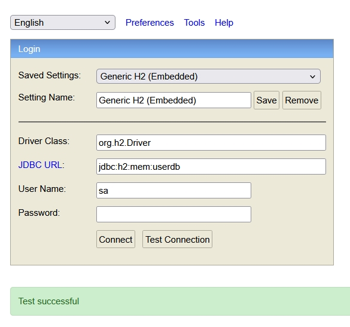
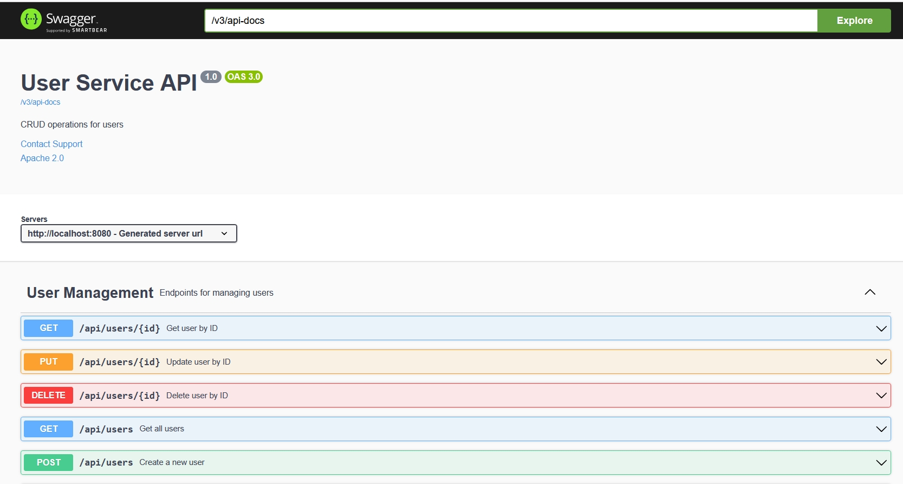
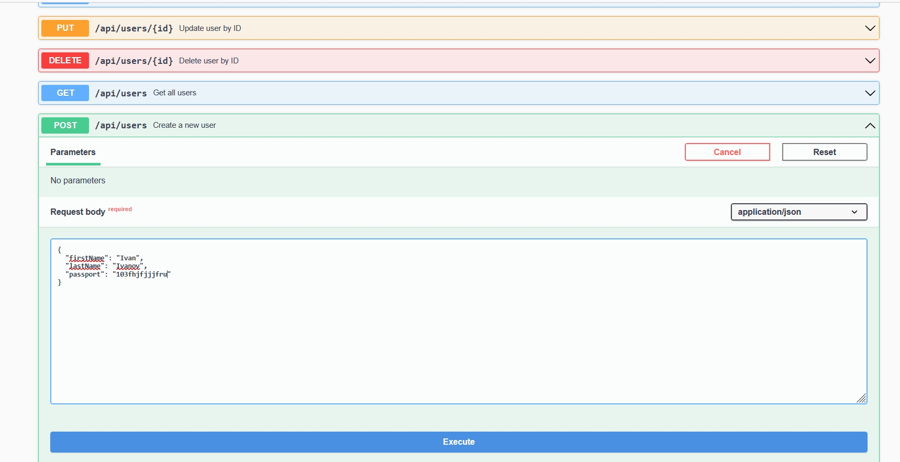
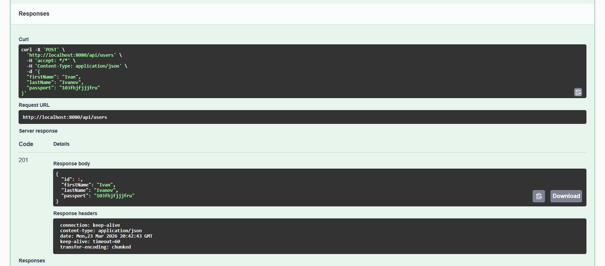
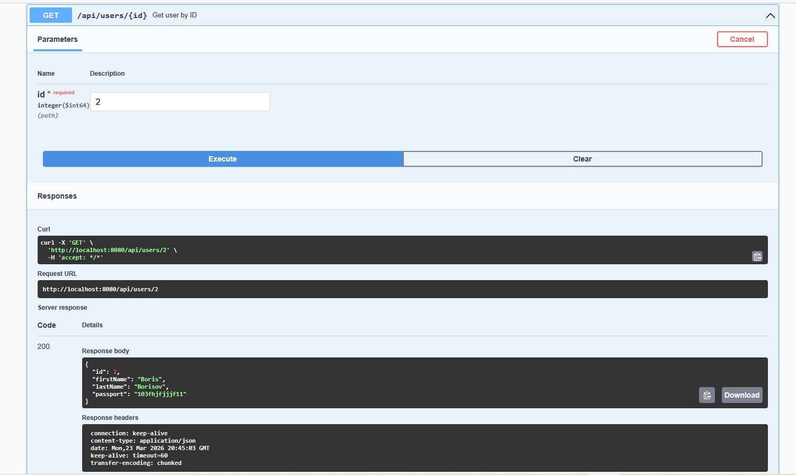
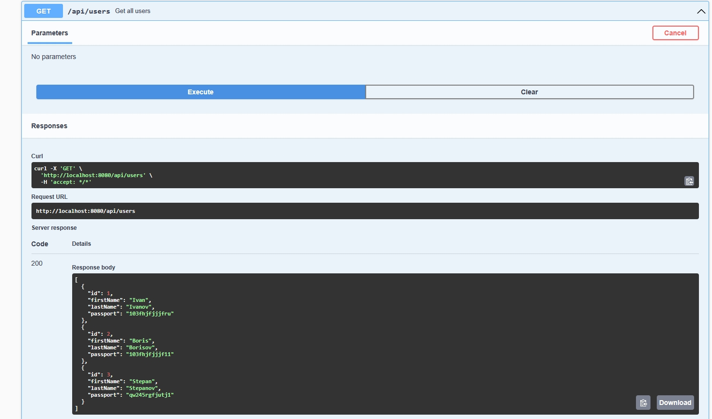
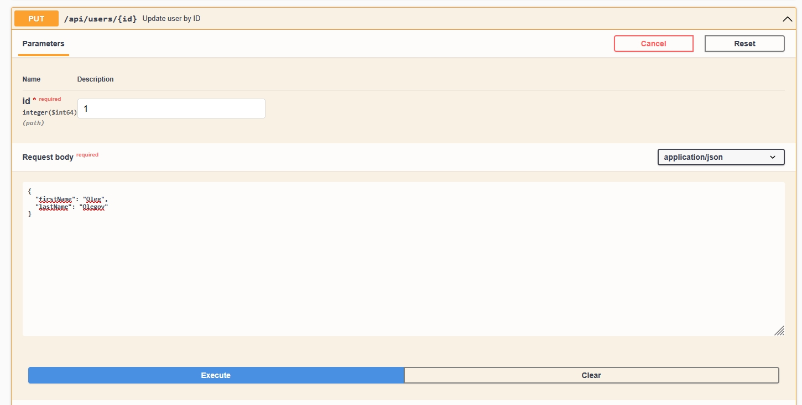
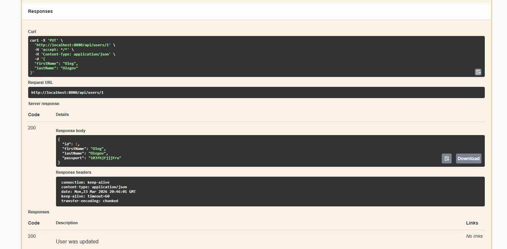
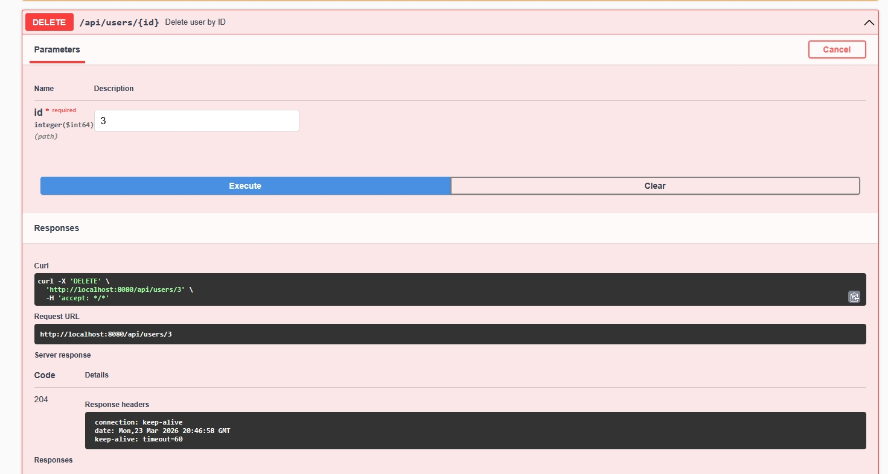
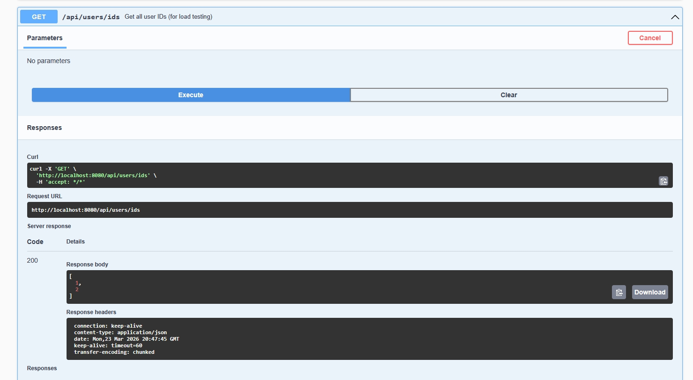

📘 User Service

**User Service** — это микросервис, реализующий CRUD‑операции над пользователями, включая валидацию данных, централизованную обработку ошибок, документирование API через OpenAPI/Swagger и покрытие unit и integration тестами.  
Сервис разработан с учётом production‑подходов: чистая архитектура, тестируемость, миграции через Liquibase и удобная структура проекта.

🚀 Основные возможности

- Создание, получение и удаление пользователей
- Проверка уникальности паспортных данных
- Централизованная обработка ошибок
- Документированный REST API через Swagger UI
- Поддержка H2 in‑memory базы данных
- Полное покрытие unit и integration тестами
- Готовность к нагрузочному тестированию

🛠️ Технологический стек

| Компонент          | Технология                        |
|--------------------|-----------------------------------|
| Язык               | Java 17                           |
| Фреймворк          | Spring Boot 3                     |
| База данных        | H2 (in‑memory)                    |
| ORM                | Hibernate / JPA                   |
| Миграции           | Liquibase                         |
| Документация API   | Springdoc OpenAPI / Swagger UI    |
| Тестирование       | JUnit 5, Spring Boot Test, MockMvc|
| Сборка             | Maven                             |
| Логирование        | Slf4j                             |

📂 Структура проекта
```
## user-service
├── src/main/java/ru/ageeva/userservice
│   ├── controller          # REST-контроллеры (UserController)
│   ├── service             # Бизнес-логика (UserService)
│   ├── repository          # JPA-репозитории (UserRepository)
│   ├── entity              # JPA-сущности (UserEntity)
│   ├── dto                 # DTO-модели (UserCreateDto, UserResponseDto)
│   ├── exception           # Кастомные исключения (DuplicatePassportException) + GlobalExceptionHandler
│
├── src/main/resources
│   ├── application.yml     # Конфигурация приложения
│   └── db/changelog        # Liquibase миграции
│
└── src/test/java/ru/ageeva/userservice
    ├── controller          # Тесты контроллера (MockMvc)
    ├── service             # Unit-тесты сервисного слоя
    └── integration         # Интеграционные тесты (REST + DB)
```

🧪 Тестирование

Проект содержит:

Unit-тесты для сервисов, контроллеров и утилит

Integration-тесты для REST API, базы данных и миграций

Использование MockMvc, H2 и Spring Boot Test

Запуск тестов:

## **mvn test**

🗄️ База данных

Используется H2 in-memory, что позволяет запускать сервис без внешних зависимостей.

Liquibase автоматически создаёт таблицы при старте.

Консоль H2 доступна по адресу:

## **http://localhost:8080/h2-console**



📑 Swagger / OpenAPI

После запуска сервиса документация доступна по адресу:

## **http://localhost:8080/swagger-ui/index.html**



▶️ Запуск приложения

## **mvn spring-boot:run**

Или:

## **mvn clean install**
## *java -jar target/user-service.jar**

📬 REST API 

Создать пользователя

## **POST /api/users**




Получить пользователя по ID

## **GET /api/users/{id}**



Получить список пользователей

## **GET /api/users/**



Изменить пользователя

## **PUT /api/users/{id}**




Удалить пользователя

## **DELETE /api/users/{id}**



Получить список ID пользователей

## **GET /api/users/ids**



⚠️ Обработка ошибок

Все ошибки обрабатываются централизованно через GlobalExceptionHandler.

Пример ответа:

{
"message": "User with passport '123456' already exists"
}